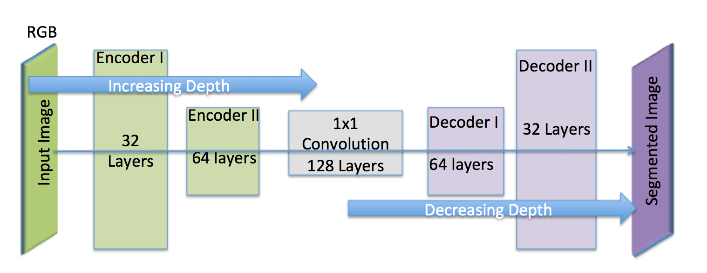

## Deep Learning Project ##
This project illustrates the training of a fully convolutional network (FCN) to identify target-person from a simulated drone camera feed. 
The FCN is used to provide semantic segmentation of input images.
The FCN does the convolution and preserves the spatial information throughout the entire network with the use of semantic segmentation.  The image below illustrates the model used to complete the project.

## Model Used ##

* 2 Encoders with a filter size of 32 and 64 respectively, with a stride of 2
  * The two encorders contain individual convolution layers. Each layer is discerning the unique features or characteristics that discern   the images or make them unique. The use of multiple encoders or convolution layers builds the depth of the segmentation and strengthens   the overall classifier. Overall, this left half produces feature vectures to identify the object.

* 1 x 1 convolution layer with a filter size of 128, and the standard kernel and stride size of 1
  * The 1x1 convolution layers flattens the data for classification, in addition to retaining the spatial data. 

* 2 Decoders with a filter size of 64 and 32 respectively, with a stride of 2.
  * The output layer implements a softmax function to the decoder block-2's output.  The final output is segmentation. 
  Overall, this right half decodes the information from the right half to provide predictions.

* The left half of the network maps RGB image pixels to a collection of feature data. The right half produces image segmentation using the the identified feature data from the left half. The output is converted back into the original rgb pixel format, and prodives the means for input image predictions.

## Hyperparameters ##

* The hyperparameters were empirically tested. Given the limited computational power of the setup, I was conservative with the parameters.  Overall, the analysis still took some time to complete (4-5 hours).

## Scoring ##

To score the network on the Follow Me task, two types of error are measured. First the intersection over the union for the pixelwise classifications is computed for the target channel. 

In addition to this we determine whether the network detected the target person or not. If more then 3 pixels have probability greater then 0.5 of being the target person then this counts as the network guessing the target is in the image. 

We determine whether the target is actually in the image by whether there are more then 3 pixels containing the target in the label mask. 

Using the above the number of detection true_positives, false positives, false negatives are counted. 

** Final score**

The final score is the pixelwise `average_IoU*(n_true_positive/(n_true_positive+n_false_positive+n_false_negative))` on data similar to that provided in sample_evaulation_data

The final score is not very good, with a score just above the passing criteria.

**Ideas for Improving your Score**

* Collect more data from the sim. More pictures at different angles and heights.

* Decreasing the stride --The amount by which the filter slides. Decreasing the stride increases the size of your model by increasing the number of total patches each layer observes- which results in improved accuracy at the expense of increased computational load.

* Increase the connections of neurons to each patch by increasing the filter depth.  This can be done by increasing hyperparameter height of K in the layers.

* Increase the number of encoder convolution layers. This will enrich the feature depth and improve segmentation.

## Final Notes 
The FCN was trained with images of the target person and not-targets from the simulated drone environment. As trained, the model would not work with other objects or items, such as dogs, cars, planes etc.  To do so would require training the model with a different set of data(images). 

The github repos was used a reference during the coding of the encoder and decoder.
https://github.com/PatrickMockridge/Udacity-DeepLearning-Follow-Me/blob/master/code/model_training.ipynb

