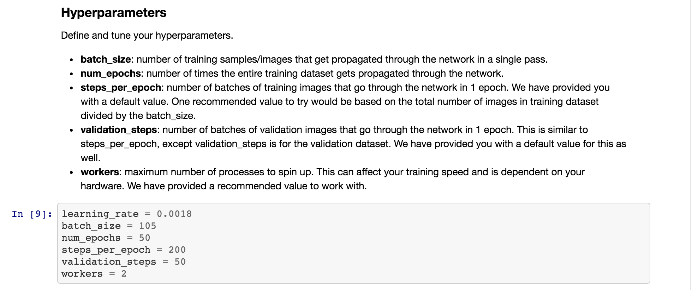
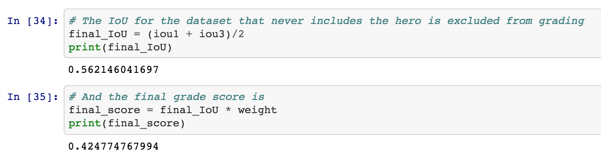

## Deep Learning Project ##

## Model ##

## Hyperparameters ##

## Scoring ##

To score the network on the Follow Me task, two types of error are measured. First the intersection over the union for the pixelwise classifications is computed for the target channel. 

In addition to this we determine whether the network detected the target person or not. If more then 3 pixels have probability greater then 0.5 of being the target person then this counts as the network guessing the target is in the image. 

We determine whether the target is actually in the image by whether there are more then 3 pixels containing the target in the label mask. 

Using the above the number of detection true_positives, false positives, false negatives are counted. 

** Final score**

The final score is the pixelwise `average_IoU*(n_true_positive/(n_true_positive+n_false_positive+n_false_negative))` on data similar to that provided in sample_evaulation_data

**Ideas for Improving your Score**

Collect more data from the sim. Look at the predictions think about what the network is getting wrong, then collect data to counteract this. Or improve your network architecture and hyperparameters. 

